How to install Proethos2 in Windows
===================================

XAMPP
-----

The XAMPP will manage the Apache2, PHP, MySQL and PHPMyAdmin in your machine.
Its an toolkit that make your job so much easier.

- Install XAMPP application in your machine. Go to [this site](https://www.apachefriends.org/index.html) below and click in
XAMPP for Windows.
- Download the installer and execute it
- Follow the screenshots below:

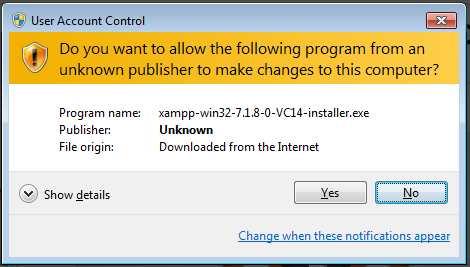

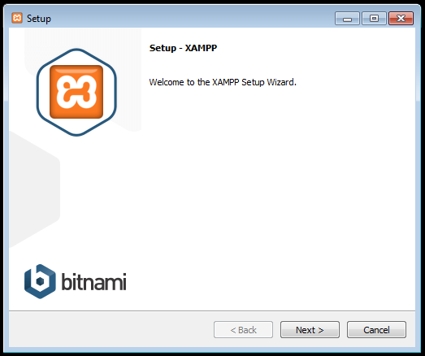


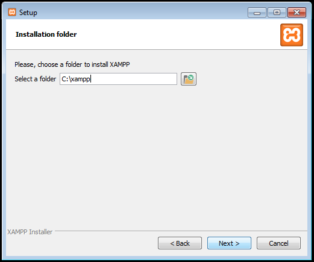

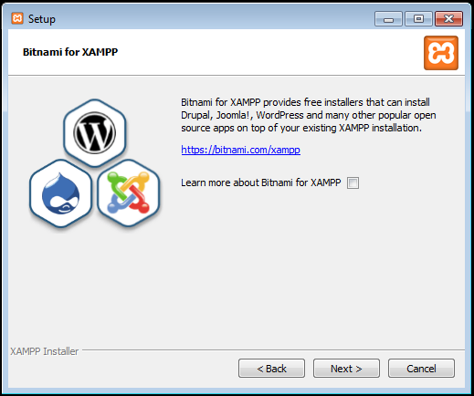

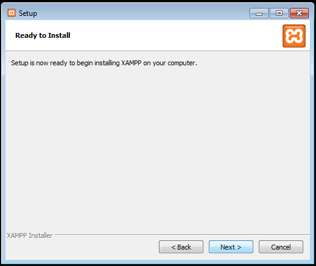

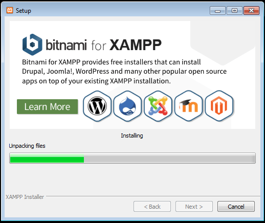


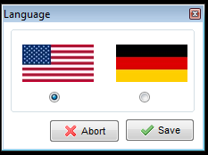

- When instalation is done, open the XAMPP Control Panel and click in `Start` buttons to Apache and MySQL.
- Now, click in `Admin` in MySQL. You will be redirected to PHPMyAdmin. 
- Click in `SQL` tab, fill with commands below and press `Execute`.
```
CREATE USER 'proethos2'@'localhost' IDENTIFIED BY 'choose_a_password!';
CREATE DATABASE proethos2;
GRANT ALL PRIVILEGES ON proethos2.* to proethos2@localhost;
```

Git
---

Git will be used to download de project.
- Install Git going to [this link](https://git-scm.com/download/win) and downloading the last
version of software.
- Follow the screenshots below:

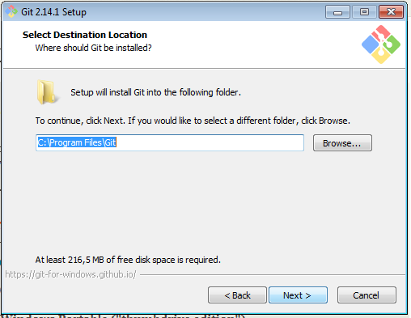

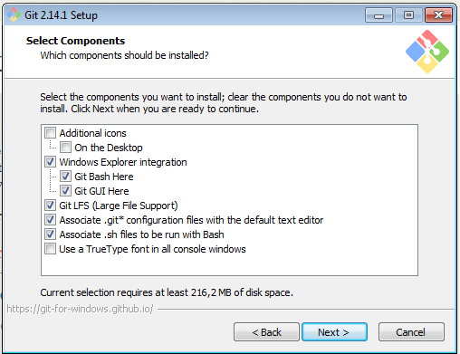

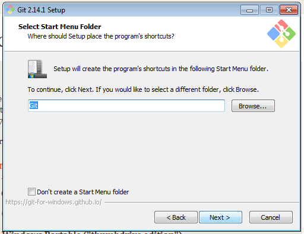

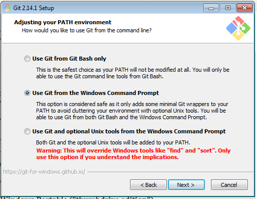

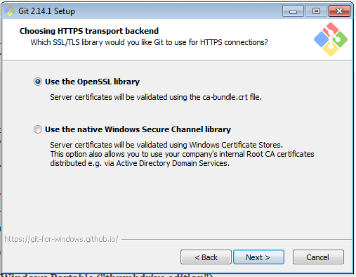

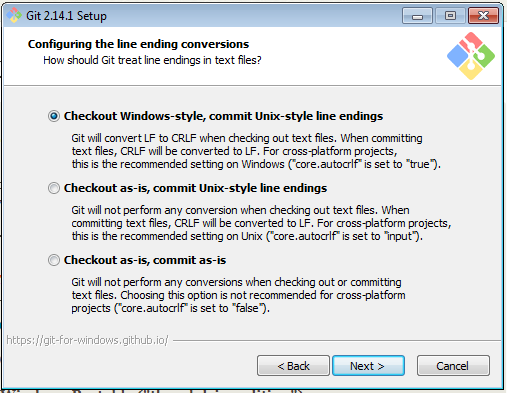

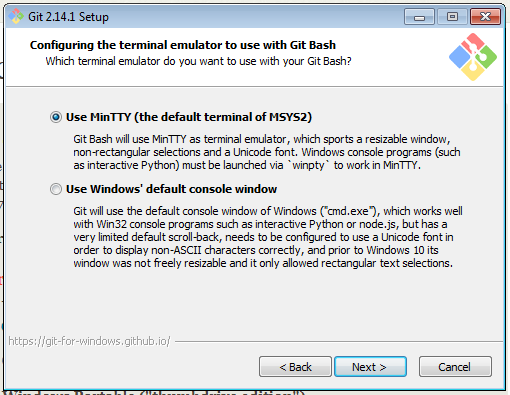

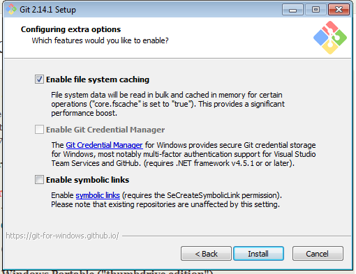

Composer
--------

- Do a right click in Desktop and choose "Open Git Bash here"
- Execute the commands below:
```
cd c:/xampp/php

./php.exe -r "copy('https://getcomposer.org/installer', 'composer-setup.php');"
./php.exe -r "if (hash_file('SHA384', 'composer-setup.php') === '544e09ee996cdf60ece3804abc52599c22b1f40f4323403c44d44fdfdd586475ca9813a858088ffbc1f233e9b180f061') { echo 'Installer verified'; } else { echo 'Installer corrupt'; unlink('composer-setup.php'); } echo PHP_EOL;"
./php.exe composer-setup.php
./php.exe -r "unlink('composer-setup.php');"
```

wkhtmltopdf
-----------

- Access the link [https://wkhtmltopdf.org/downloads.html](https://wkhtmltopdf.org/downloads.html) and
download the last version according to your operating system.
- Execute the Installation Wizard and finish the proccess.


Creating the file structure and install Proethos2
-------------------------------------------------

- Do a right click in Desktop and choose "Open Git Bash here"
- Execute the command `git clone https://github.com/bireme/proethos2.git`

- Now, we have to install all the software dependencies and the software as well:
(It can take some minutes)

```
cd symphony/
c:/xampp/php/php.exe c:/xampp/php/composer.phar install
```

In the middle of process, you will be questioned by this questions below:

- `database_driver (pdo_mysql):` We use MySQL, so, press enter.
- `database_host (127.0.0.1): ` We use a local MySQL installation (in this case), so, press enter.
- `database_port (null):` We use a default port, so, press enter.
- `database_name (symfony):` Fill in with the database name that we created. In this case `proethos2`.
- `database_user (root):` Fill in with the user that we created. In this case `proethos2`.
- `database_password (null):` Fill in with the database name that we created. In this case `choose_a_password!`.
- `mailer_transport (smtp):` We will configure this options later, so, press enter for the SMTP options.
- `locale (en):` Choose your default language locale. We will use `es_ES`
- `secret (ThisTokenIsNotSoSecretChangeIt):` Choose an secret token for your application.

Now, all system was installed. Let`s change some configs.

In file `app/config/config.yml`, go to `knp_snappy` session and change `binary` option.
Its need to be exact line the code below.
```
knp_snappy:
    pdf:
        enabled:    true
        binary:     "\"C:\\Program Files\\wkhtmltopdf\\bin\\wkhtmltopdf.exe\""
        options:    []
```

Now, we will setup the database. Execute the following command:

```
$ c:/xampp/php/php.exe console doctrine:schema:update --force
```

Now, access again PHPMyAdmin, click in `proethos2` link in the left side, click in `Import` tab and
import all files below:

```
symphony/fixtures/data_list_clinical_trial_name.sql
symphony/fixtures/data_list_country.sql
symphony/fixtures/data_list_gender.sql
symphony/fixtures/data_list_monitoring_action.sql
symphony/fixtures/data_list_recruitment_status.sql
symphony/fixtures/data_list_role.sql
symphony/fixtures/data_upload_type_extension.sql
symphony/fixtures/data_upload_type.sql
symphony/fixtures/data_upload_type_upload_type_extension.sql
symphony/fixtures/data_help.sql
symphony/fixtures/data_faq.sql
symphony/fixtures/data_ext_translations.sql
symphony/fixtures/data_configuration.sql
symphony/fixtures/data_user.sql
symphony/fixtures/data_user_role.sql
```

If you want to test the instalation, run this command:
```
c:/xampp/php/php.exe console server:run -v 0.0.0.0:8000
```

and now access the address `http://YOUR_IP_SERVER:8000/`. If you see the login page, means that you made all right!

To guarantee that all system is working perfectly, we will install __phpunit__ and run
all automated tests.

```
c:/xampp/php/php.exe c:/xampp/php/composer.phar global require "phpunit/phpunit=4.8.2"
c:/xampp/php/php.exe c:/xampp/php/composer.phar install
```

Now, we will run the tests:
```
cd app/
c:/xampp/php/php.exe c:/xampp/php/phpunit --stop-on-failure
```

Configuring the Apache2 to serve Proethos2
------------------------------------------

Now, we will configure the Apache2 to serve the Proethos2 in the 80 port.

This is a model to you start. Feel free to modify as your needs:

```
<VirtualHost *:80>
    ServerName www.youraddress.com

    ServerAdmin adminemail@localhost
    DocumentRoot C:\Users\<user>\Desktop\proethos2\symphony\web

    DirectoryIndex index.php index.html index.htm

    <Directory C:\Users\<user>\Desktop\proethos2\symphony\web\>
        Options FollowSymLinks
        AllowOverride All
        Order allow,deny
        Allow from all
        Require all granted
    </Directory>

    ErrorLog ${APACHE_LOG_DIR}/error.log
    CustomLog ${APACHE_LOG_DIR}/access.log combined
</VirtualHost>
```

We need to put this content on `/etc/apache2/sites-available/proethos2.conf`.
Now, we have to disable the default conf that comes with apache2 and add our conf:


Software configuration
======================

SMTP and emails
---------------

Go to `config/parameters.yml` and add/change these parameters, according to your e-mail service:

```
mailer_transport: smtp
mailer_host: 127.0.0.1
mailer_user: null
mailer_password: null

```

For more informations about this theme, access http://symfony.com/doc/2.7/email.html.

Adding routines to crontab
--------------------------

TODO (???)

Other configurations and customizations
---------------------------------------

The system comes with pre-stablished configuration. But, if you want to change or customize your instalation, make login
as an admin role and access System Management > Configurations.


That's it!

If you have any questions or difficults to execute this steps, please [open an ticket here](https://github.com/bireme/proethos2/issues).


